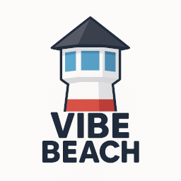
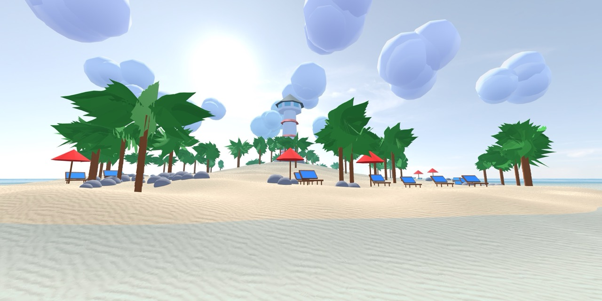
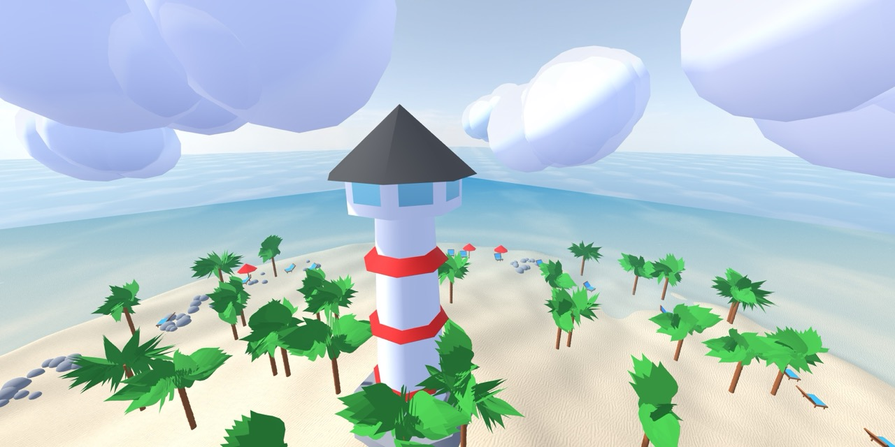
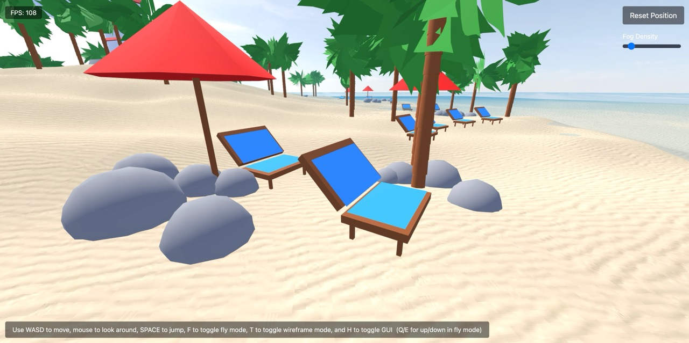
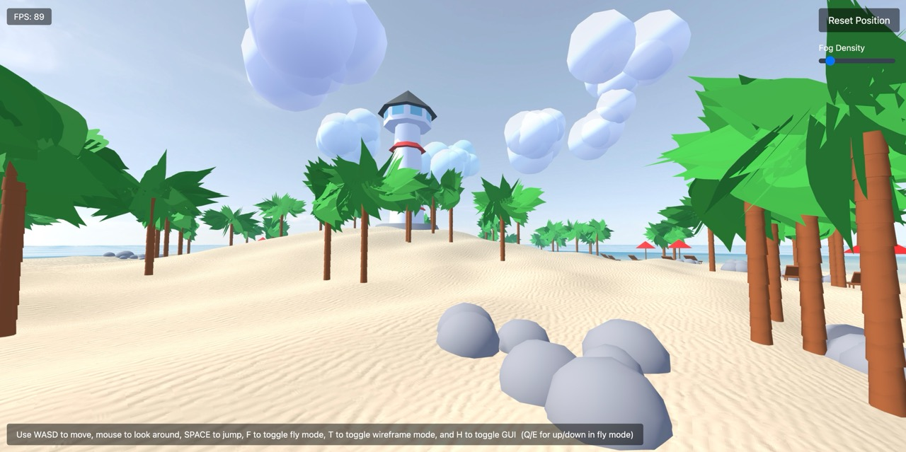

# Vibe Beach 🏖️

## 🌐 Take a Dip!

[https://bramtechs.github.io/vibe-beach/](https://bramtechs.github.io/vibe-beach/)



> 🌊 **Welcome to Vibe Beach!** Where the sun never sets and the vibes are always right. This isn't just another web app - it's your personal beach getaway, right in your browser! 🎉

## 📸 Picture Perfect

<table>
  <tr>
    <td></td>
    <td></td>
  </tr>
  <tr>
    <td></td>
    <td></td>
  </tr>
</table>

## 🏄‍♂️ What's the Vibe?

Vibe Beach is your digital oasis - a stunning 3D beach environment that brings the perfect beach day to your screen, no sunscreen required! Built with cutting-edge tech and a whole lot of love, this project combines the power of React, TypeScript, and Three.js to create an experience that's as smooth as the ocean breeze.

> 💻 **Fun Fact:** This entire project was born from the creative minds of AI! From the first line of code to the final pixel, it's been crafted with the help of Bolt AI, Cursor IDE, and Claude AI. Who says robots can't be creative? 🤖✨

## 🌟 Why You'll Love It

- 🏖️ **Immersive 3D Beach:** Feel like you're actually there with our stunning Three.js environment
- 🎨 **Beautiful UI:** Clean, modern design that's as refreshing as a cold drink on a hot day
- 📱 **Responsive Design:** Looks amazing on any device - from phones to giant monitors
- ⚡ **Lightning Fast:** Built with Vite for performance that's faster than a seagull chasing a chip
- 🛡️ **Type-Safe:** TypeScript keeps everything running smoothly, just like a well-oiled beach umbrella

## 🛠️ Tech Stack (The Good Stuff)

| Category       | Tech         |
| -------------- | ------------ |
| **Frontend**   | React 18     |
| **Language**   | TypeScript   |
| **3D Magic**   | Three.js     |
| **Styling**    | Tailwind CSS |
| **Build Tool** | Vite         |
| **Icons**      | Lucide React |

## 🎵 Vibe Beach Original Soundtrack

The island features a jukebox with amazing tracks that you can listen to while exploring. To listen to the music:

1. Find the jukebox on the island (coordinates: 10, 0, 10)
2. Press 'P' to mute/unmute
3. Press 'N' to switch between tracks

The soundtrack includes these amazing tracks:

> 🎵 **Click the links below to download the tracks:**

- [Sunset Serenade - Jack Sanderson & The Beachcombers](https://raw.githubusercontent.com/bramtechs/vibe-beach/main/public/ost/Vibe%20Beach.mp3)
- [Midnight Tide - Luna Blackwood](https://raw.githubusercontent.com/bramtechs/vibe-beach/main/public/ost/Goth%20Vibe%20Beach.mp3)
- [Der Strand lebt - Klaus Fischer & Die Strandkörbe](https://raw.githubusercontent.com/bramtechs/vibe-beach/main/public/ost/German%20Beach.mp3)
- [Vibu Bīchi☆Etānaru - ヴィブビーチ ☆ エターナル - Yuki Tanaka & ビーチ ☆ ガールズ (Beach☆Girls)](https://raw.githubusercontent.com/bramtechs/vibe-beach/main/public/ost/Weeb%20Beach.mp3)
- [Thunder Beach - Axel Storm & Metal Tide](https://raw.githubusercontent.com/bramtechs/vibe-beach/main/public/ost/Metal%20Beach.mp3)
- [Strandvibes - Pieter van Dijk](https://raw.githubusercontent.com/bramtechs/vibe-beach/main/public/ost/Strandvibes.mp3)
- [Swag In De Lucht - Anneke van der Meer](https://raw.githubusercontent.com/bramtechs/vibe-beach/main/public/ost/Swag%20Beach.mp3)
- ['t Ritme Leeft Hier - Janneke & De Strandgasten](https://raw.githubusercontent.com/bramtechs/vibe-beach/main/public/ost/Flemish%20Beach.mp3)

> 💡 **Pro Tip:** For the best experience, launch the application and listen to the music through the 3D jukebox in the scene. The positional audio system creates an immersive experience where the music volume changes based on your distance from the jukebox!

## 🎮 Quick Start Guide

1. **Clone & Chill:**

   ```bash
   git clone https://github.com/bramtechs/vibe-beach
   cd vibe-beach
   ```

2. **Install the Goodies:**

   ```bash
   npm install
   ```

3. **Start the Party:**

   ```bash
   npm run dev
   ```

4. **Ready for Production:**
   ```bash
   npm run build
   ```

## 🎮 Available Commands

| Command           | What it Does                 |
| ----------------- | ---------------------------- |
| `npm run dev`     | Start the development server |
| `npm run build`   | Build for production         |
| `npm run lint`    | Check code quality           |
| `npm run preview` | Preview the production build |

## 📁 Project Structure

```
vibe-beach/
├── src/           # Where the magic happens
├── public/        # Static goodies
├── node_modules/  # All the dependencies
├── .vscode/       # VS Code settings
├── .bolt/         # Bolt config
└── config files   # Various configs
```

## 🤝 Join the Party!

We'd love to have you contribute! Whether you're fixing bugs, adding features, or just improving the vibes, your help is welcome.

### 🤖 Our AI-First Philosophy

- AI is our co-pilot! We encourage AI-assisted development
- Human-written code is so last century 😉
- Contributors should communicate via LLMs.

## 📄 License

This project is licensed under the GNU General Public License v3.0 (GPL v3) - see the LICENSE file for details.

## 🙏 Special Thanks

- Three.js community for making 3D magic possible
- Vite team for the lightning-fast build tool
- React team for the amazing framework
- Cursor IDE for the smooth development experience
- Claude AI for being the best coding buddy
- Polyhaven for the beautiful skybox textures
- Suno for the amazing music
- And YOU for checking out our project! 🎉
